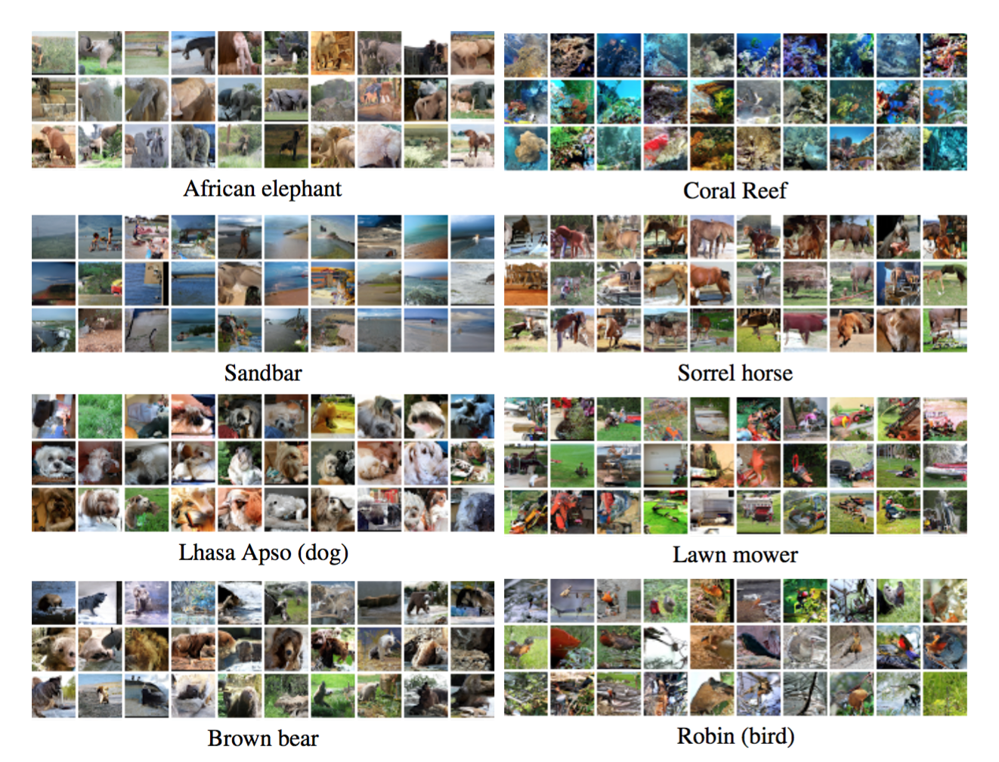
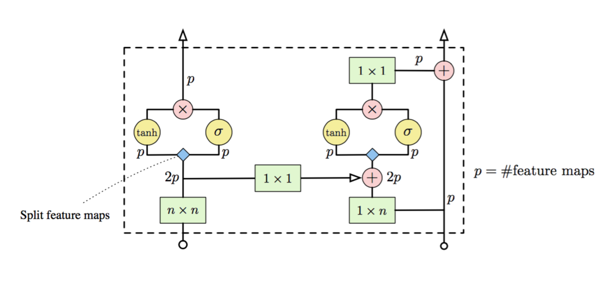
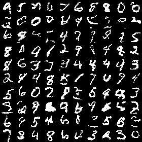
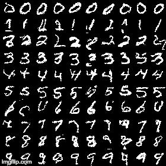
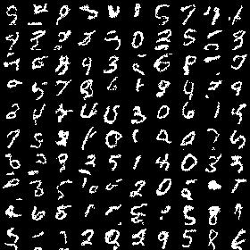
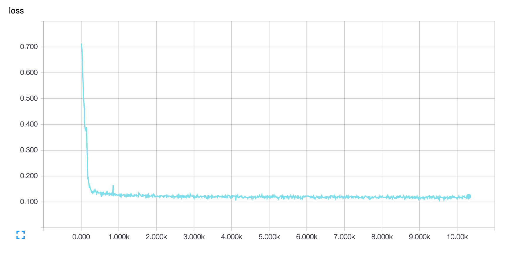

# Image Generation with Gated PixelCNN Decoders

This is a Tensorflow implementation of [Conditional Image Generation with PixelCNN Decoders](https://arxiv.org/abs/1606.05328) which introduces the Gated PixelCNN model based on PixelCNN architecture originally mentioned in [Pixel Recurrent Neural Networks](https://arxiv.org/abs/1601.06759). The model can be conditioned on latent representation of labels or images to generate images accordingly. Images can also be modelled unconditionally. It can also act as a powerful decoder and can replace deconvolution (transposed convolution) in Autoencoders and GANs. A detailed summary of the paper can be found [here](https://gist.github.com/anantzoid/b2dca657003998027c2861f3121c43b7). 

These are some conditioned samples generated by the authors of the paper:



## Architecture

This is the architecture for Gated PixelCNN used in the model: 



The gating accounts for remembering the context and model more complex interactions, like in LSTM. The network stack on the left is the Vertical stack that takes care of blind spots that occure while convolution due to the masking layer (Refer the Pixel RNN paper to know more about masking). Use of residual connection significantly improves the model performance.

## Usage

This implementation consists of the following models based on the Gated PixelCNN architecture:

- **Unconditional image generation**:  
    ```
    python main.py
    ```

    Sample generated by training MNIST dataset after 70 epochs with a cross-entropy loss of 0.104610:

    

- **Conditional image generation based on class labels**: 
    ```
    python main.py --model=conditional
    ```

    As mentioned in the paper, conditionally generated images are more visually appealing though the loss difference is almost same. It has a loss of 0.102719 after 40 epochs:
    
    
    
- **Autoencoder with PixelCNN decoder**: 
    ```
    python main.py --model=autoencoder
    ```

    The encoder part of the autoencoder has the original architecture as mentioned in [Stacked Convolutional Auto-Encoders for Hierarchical Feature Extraction](https://pdfs.semanticscholar.org/1c6d/990c80e60aa0b0059415444cdf94b3574f0f.pdf). The representation is encoded into 10d tensor. The image generated after 10 epochs with a loss of 0.115306:

    

To only generate images append the `--epochs=0` flag after the command. 

To train the any model on CIFAR-10 dataset, add the `--data=cifar` flag.

Refer `main.py` for other available flags for hyperparameter tuning.

## Training Details

The system was trained on a single AWS p2.xlarge spot instance. The implementation was only done on MNIST dataset. Generation of samples based on CIFAR-10 images took the authors 32 GPUs trained for 60 hours.

To visualize the graph and loss during training, run: 
```
tensorboard --logdir=logs
```

Loss minimization for the autoencoder model: 


